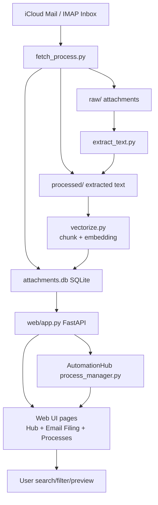

# OrgHub

OrgHub is a local-first FastAPI web app that helps you organize and search email attachments.

It ingests attachments from iCloud Mail, extracts text from common file types, creates embeddings for semantic search, and exposes everything through a clean web UI.

## What it does

- Pulls email messages + attachments from IMAP (iCloud by default)
- Saves files locally with normalized names
- Classifies attachments into categories/tags
- Extracts text from PDFs, Office docs, and images (OCR)
- Chunks + embeds extracted text for semantic search
- Stores metadata and vectors in SQLite
- Provides a browser UI to:
  - search by meaning (not just keywords)
  - filter by category/sender/tag
  - preview/download source attachments
- Includes a process-management module for automation scripts

## Architecture



## Project structure

- `web/app.py` — FastAPI app and routes
- `web/*.html` — Jinja templates for hub + tools
- `fetch_process.py` — IMAP ingest + classification + DB writes
- `extract_text.py` — text extraction/OCR helpers
- `vectorize.py` — chunking + OpenAI embeddings
- `start_web.sh` — start script for local web server
- `attachments.db` — local database (ignored in git)

## Run locally

1. Create/activate virtualenv
2. Install deps:
   ```bash
   pip install -r requirements.txt
   ```
3. Configure `.env` (see required vars below)
4. Start app:
   ```bash
   ./start_web.sh
   ```
5. Open:
   - `http://127.0.0.1:8000`

## Required environment variables

Typical `.env` keys used by the project:

- `OPENAI_API_KEY`
- `EMBEDDING_MODEL` (optional, default `text-embedding-3-large`)
- `ICLOUD_EMAIL`
- `ICLOUD_APP_PASSWORD`
- `IMAP_HOST` (optional, default `imap.mail.me.com`)
- `INGEST_START_YEAR` (optional)
- `OBSIDIAN_SUMMARY_FOLDER` (optional)
- `OBSIDIAN_VAULT_PATH` (optional)

## Notes

- This repo intentionally ignores secrets/runtime data (`.env`, `.venv`, DB files, logs, raw/processed attachments).
- The app is currently bound to localhost (`127.0.0.1`) for safety.
